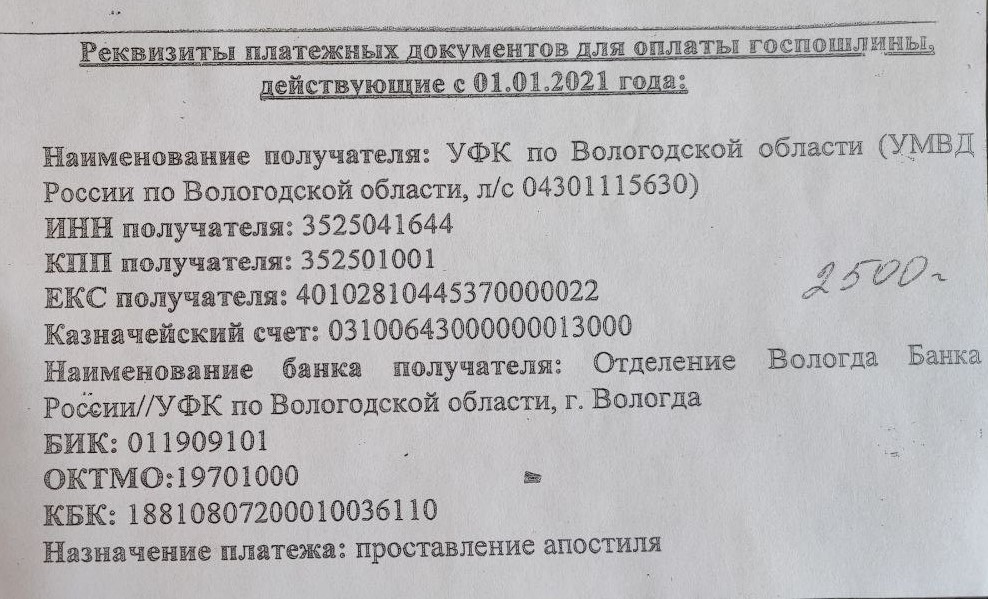

## Апостиль

### Общая информация

Смотрите [здесь](https://gogov.ru/apostille/vologda).

### Апостиль на свидетельство о рождении

Если у вас свидетельство о рождении старого стандарта (например, СССР с вкладышем Российской Федерации), то на него
апостиль наложить не удастся. Сначала свидетельство нужно заменить на новое.

#### Замена свидетельства о рождении старого стандарта на новый

Через онлайн заявку:

1. оформить заявку на замену свидетельства (повторное получение свидетельства о рождении)
   на [портале ГосУслуг](esia.gosuslugi.ru):
    * в рамках оформлении заявки оплачивается квитанция (при оплате онлайн 30% скидка);
2. после исполнения заявки на [портале ГосУслуг](esia.gosuslugi.ru) придет уведомление о выборе даты и отделения ЗАГС
   для получения свидетельства нового формата.

Без онлайн заявки:

1. идти в ЗАГС по адресу Комсомольская улица, 4;
2. идти в кабинет 5 (от входа направо);
3. на месте можно оплатить квитанцию на 350 рублей по QR коду (QR код с описанием на стене напротив кабинета), после
   чего отправить квитанцию на почту (указана в той же бумажке на стене);
4. Новое свидетельство о рождении выдают минут за 10-20 прямо на месте.

#### Получение апостиля на свидетельство о рождении актуального стандарта

Для наложения апостиля на свидетельство о рождении актуального стандарта:

1. идти в ЗАГС, который по адресу Советский проспект, 17;
2. также оплачивается квитанция на 2500 рублей оплачивается на месте по QR коду с бумажки и отправляется на почту,
   указанную на этой же бумажке;
3. документ забирают, апостиль накладывают за 1-2 дня.

### Апостиль на диплом

Для получения апостиля на диплом необходимо:

1. записаться на прием в Департамент образования Вологодской области:
    * записываться посредством звонка `+7 8172 23-01-03` (добавочный номер сотрудника 2031, Анастасия Сергеевна);
2. оплатить госпошлину:
    * реквизиты для оплаты госпошлины смотрите
      [здесь](https://depobr.gov35.ru/deyatelnost/protivodeystvie-korruptsii/antikorruptsionnaya-ekspertiza/%D1%80%D0%B5%D0%BA%D0%B2%D0%B8%D0%B7%D0%B8%D1%82%D1%8B%20%D0%B4%D0%BB%D1%8F%20%D0%BE%D0%BF%D0%BB%D0%B0%D1%82%D1%8B%20%D0%B0%D0%BF%D0%BE%D1%81%D1%82%D0%B8%D0%BB%D1%8C%20(1)%20(1).docx)
      ;
    * квитанцию по оплате:
        * либо отправить на почту `apostilDO@gov35.ru`;
        * либо распечатать и взять с собой при визите (см. следующий пункт);
3. в дату приема идти в Департамент образования Вологодской области (Козленская улица, 114) кабинет 203 (Анастасия
   Сергеевна), при себе иметь:
    * паспорт;
    * диплом и приложение к нему;
    * квитанцию (в случае, если в предыдущем пункте не отправили её на почту).

Подробная информация
находится [здесь](https://depobr.gov35.ru/deyatelnost/deyatelnost-strukturnykh-podrazdeleniy/osushchestvlenie-peredannykh-polnomochiy/apostil/index.php)
.

### Апостиль на справку об отсутствии судимости

1. [на портале ГосУслуг](esia.gosuslugi.ru) сформировать запрос на получение справки об отсутствии судимости (бумажный
   вариант без апостиля);
2. после получения на [портале ГосУслуг](esia.gosuslugi.ru) приглашения на получение справки выбрать дату и время
   посещения УМВД (ул. Мира, д. 30):
    * при получении справки запросить реквизиты для оплаты квитанции для наложения апостиля,
      либо [оплатить по реквизитам](#certificate-of-no-criminal-record_receipt);
3. оплатить квитанцию, распечатать чек;
4. прийти на получение апостиля в УМВД (ул. Мира, д. 30), взять талон в живую очередь, при себе иметь:
    * справка об отсутствии судимости;
    * паспорт.

Пример реквизитов для оплаты квитанции на получение апостиля

